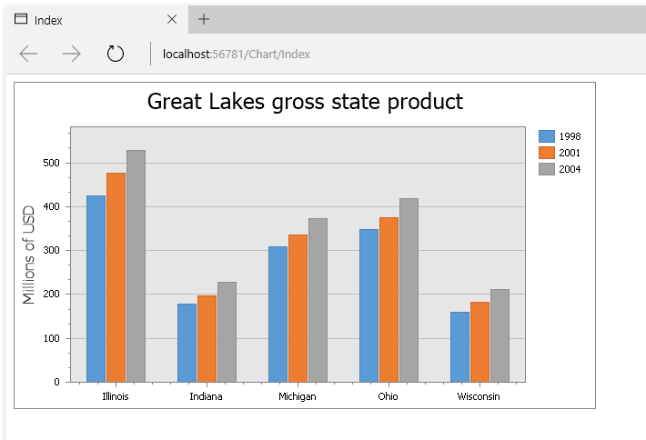

<!-- default badges list -->

<!-- default badges end -->

# Chart for MVC - Create a Simple Unbound Chart

This example shows how to build a chart in Visual Studio with manually created and populated series.

## Files to Review

* [ChartController.cs](./CS/GettingStarted1/Controllers/ChartController.cs) (VB: [ChartController.vb](./VB/GettingStarted1/Controllers/ChartController.vb))
* [Global.asax](./CS/GettingStarted1/Global.asax) (VB: [Global.asax](./VB/GettingStarted1/Global.asax))
* [Global.asax.cs](./CS/GettingStarted1/Global.asax.cs) (VB: [Global.asax.vb](./VB/GettingStarted1/Global.asax.vb))
* [Index.cshtml](./CS/GettingStarted1/Views/Chart/Index.cshtml)

## Documentation 

* [Lesson 1 - Create a Simple Unbound Chart](https://docs.devexpress.com/AspNetMvc/114629/components/charting/getting-started/lesson-1-create-a-simple-unbound-chart)

